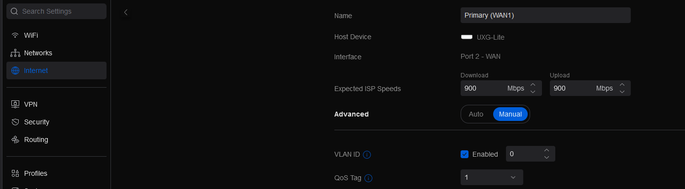

# Unifi Gateway wpa_supplicant bypass for ATT fiber modem
Use this guide to setup wpa_supplicant with your Unifi gateway to bypass the ATT modem.

This will work on any modern [Unifi Console or Gateway](https://www.reddit.com/r/Ubiquiti/comments/1870ryr/unifi_gateways_explained_as_simple_as_possible/) running UniFi OS 3.x or 4.x. To my knowledge, that includes everything except the original USG which will have a different process that is already well documented over the years (check [Additional resources](#additional-resources)).

> [!IMPORTANT]
> Take note of your Unifi gateway's WAN port interface name. In the rest of the guide, I'll be using `eth1` because that is the WAN interface for the UXG Lite. If using another Unifi gateway, replace the interface name appropriately.

Here are some known interfaces for Unifi gateways, for use in the rest of the guide. Double check with your device to be sure.
- UXG Lite or UX  - eth1
- UXG Pro - eth0 (WAN1, RJ-45), eth2 (WAN2, SFP+)
- UXG Max - eth4
- UCG Ultra - eth4
- UDR and UDM-Base (the egg) - eth4
- UDM Pro or SE - eth8 (WAN1, RJ-45), eth9 (WAN2, SFP+)

### Prerequisites:
- extracted and decoded certificates from an ATT modem

Instructions to [extract certs from BGW210/BGW320](https://github.com/0x888e/certs)

## Table of Contents
- [Install wpa_supplicant](#install-wpa_supplicant-on-unifi-gateway) - install wpasupplicant on your Unifi gateway
- [Copy certs and config](#copy-certs-and-config-to-unifi-gateway) - copy files generated from mfg_dat_decode tool into Unifi gateway
- [Spoof MAC Address](#spoof-mac-address) - spoof Unifi WAN port to match original ATT gateway MAC address
- [Set Unifi network settings](#set-unifi-network-settings) - set required network settings (VLAN0) in Unifi dashboard
- [Test wpa_supplicant](#test-wpa_supplicant) - test wpasupplicant
- [Setup wpa_supplicant service for startup](#setup-wpa_supplicant-service-for-startup) - start wpasupplicant on Unifi gateway bootup
- [Survive firmware updates](#survive-firmware-updates) - automatically restore and setup wpasupplicant after firmware updates wipe it

## Install wpa_supplicant on Unifi gateway
SSH into your Unifi gateway.

> [!TIP]
> Unlike all my other Unifi devices, my SSH private key didn't work with my username, but worked with the `root` user instead. Or user + password defined in `Settings` -> `System` -> `Advanced` -> `Device Authentication`.

The Unifi gateways run a Debian-based distro, so we can install the `wpasupplicant` package.

> [!WARNING]
> Some devices such as the UDR7 and UX7 may get a version of wpasupplicant from `apt install` that does not include the wired driver. If you encounter issues with the standard installation below, use the [alternative installation method](#alternative-installation-for-udr7ux7-and-other-devices) instead.

```bash
> apt update -y
> apt install -y wpasupplicant
```

### Alternative installation for UDR7/UX7 and other devices
If the standard `apt install` method doesn't work for your device (you'll know if `wpa_supplicant` fails with driver issues), download and install the packages directly from the Debian repositories instead:

```bash
> mkdir -p /etc/wpa_supplicant/packages
> cd /etc/wpa_supplicant/packages
> wget http://security.debian.org/debian-security/pool/updates/main/w/wpa/wpasupplicant_2.9.0-21+deb11u3_arm64.deb
> wget http://ftp.us.debian.org/debian/pool/main/p/pcsc-lite/libpcsclite1_1.9.1-1_arm64.deb
> dpkg -i *.deb
```

> [!NOTE]
> These are the same packages used in the [Survive firmware updates](#survive-firmware-updates) section, so if you use this method, you can skip downloading them again later.

Create a `certs` folder in the `/etc/wpa_supplicant` folder.
```bash
> mkdir -p /etc/wpa_supplicant/certs
```

We'll copy files into here in the next step.

## Copy certs and config to Unifi gateway
Back on your computer, prepare your files to copy into the Unifi gateway.

These files come from the mfg_dat_decode tool:
- CA_XXXXXX-XXXXXXXXXXXXXX.pem
- Client_XXXXXX-XXXXXXXXXXXXXX.pem
- PrivateKey_PKCS1_XXXXXX-XXXXXXXXXXXXXX.pem
- wpa_supplicant.conf

```bash
> scp *.pem <gateway>:/etc/wpa_supplicant/certs
> scp wpa_supplicant.conf <gateway>:/etc/wpa_supplicant
```

> [!WARNING]
Make sure in the `wpa_supplicant.conf` to modify the `ca_cert`, `client_cert` and `private_key` to use **absolute paths**. In this case, prepend `/etc/wpa_supplicant/certs/` to the filename strings. It should look like the following...
```ini
...
network={
        ca_cert="/etc/wpa_supplicant/certs/CA_XXXXXX-XXXXXXXXXXXXXX.pem"
        client_cert="/etc/wpa_supplicant/certs/Client_XXXXXX-XXXXXXXXXXXXXX.pem"
        ...
        private_key="/etc/wpa_supplicant/certs/PrivateKey_PKCS1_XXXXXX-XXXXXXXXXXXXXX.pem"
}
```

## Spoof MAC address
We'll need to spoof the MAC address on the WAN port (interface `eth1` on the UXG-Lite) to successfully authenticate with ATT with our certificates.

In the Unifi dashboard, go to `Settings` -> `Internet` and select your WAN. Enable `MAC Address Clone` and paste the MAC address with your ATT gateway's address.

> [!TIP]
> If the above setting works for you, the rest of this section can be skipped.

Using the Unifi dashboard didn't seem to work for me (did not test extensively), and I had to manually set it up instead, based on these [instructions to spoof mac address](https://www.xmodulo.com/spoof-mac-address-network-interface-linux.html).

SSH back into your gateway, and create the following file.

`vi /etc/network/if-up.d/changemac`

```bash
#!/bin/sh

if [ "$IFACE" = eth1 ]; then
  ip link set dev "$IFACE" address XX:XX:XX:XX:XX:XX
fi
```
Replace the mac address with your gateway's address, found in the `wpa_supplicant.conf` file.

Set the permissions:
```bash
> sudo chmod 755 /etc/network/if-up.d/changemac
```
This file will spoof your WAN mac address when `eth1` starts up. Go ahead and run the same command now so you don't have to reboot your gateway.
```bash
> ip link set dev "$IFACE" address XX:XX:XX:XX:XX:XX
```

## Set Unifi network settings

> [!CAUTION]
> This section may not be applicable depending on your hardware configuration, especially if using an SFP bypass module.
>
> VLAN 0 seems to be necessary if you use the ATT external ONT. Otherwise, this step may not be needed.

### Set VLAN ID on WAN connection
ATT authenticates using VLAN ID 0, so we have to tag our WAN port with that.

In your Unifi console/dashboard, under `Settings` -> `Internet` -> `Primary (WAN1)` (or your WAN name if you renamed it), Enable `VLAN ID` and set it to `0`.

> [!WARNING]
> Before applying, note that this change will prevent you from accessing the internet until after running `wpa_supplicant` in the next step. If you need to restore internet access before finishing this setup guide, you can always disable `VLAN ID`.



Apply the change, then unplug the ethernet cable from the ONT port on your ATT Gateway, and plug it into the WAN port on your Unifi gateway.

## Test wpa_supplicant
While SSHed into the gateway, run this to test the authentication.
```bash
> wpa_supplicant -i eth1 -D wired -c /etc/wpa_supplicant/wpa_supplicant.conf
```
Breaking down this command...
- `-i eth1` Specifies `eth1` (UXG-Lite WAN port) as the interface
- `-D wired` Specify driver type of `eth1`
- `-c <path-to>/wpa_supplicant.conf` The config file

> [!TIP]
> If troubleshooting is needed, add the parameter `-C /var/run/wpa_supplicant -B` to run in the background and allow the `wpa_cli` utility to connect.
>
> This can also be achieved in the `wpa_supplicant.conf` file by adding the line `ctrl_interface=DIR=/var/run/wpa_supplicant`, which will also apply when we later have wpa_supplicant service run automatically.

You should see the message `Successfully initialized wpa_supplicant` if the command and config are configured correctly.

Following that will be some logs from authenticating. If it looks something like this, then it was successful!
```
eth1: CTRL-EVENT-EAP-PEER-CERT depth=0 subject='/C=US/ST=Michigan/L=Southfield/O=ATT Services Inc/OU=OCATS/CN=aut03lsanca.lsanca.sbcglobal.net' hash=XXXXXXXXXXXXXXXXXXXXXXXXXXXXXXXXXX
eth1: CTRL-EVENT-EAP-PEER-ALT depth=0 DNS:aut03lsanca.lsanca.sbcglobal.net
eth1: CTRL-EVENT-EAP-SUCCESS EAP authentication completed successfully
eth1: CTRL-EVENT-CONNECTED - Connection to XX:XX:XX:XX:XX:XX completed [id=0 id_str=]
```
> [!TIP]
> If you don't see the `EAP authentication completed successfully` message, try checking to make sure the MAC address was spoofed successfully.

`Ctrl-c` to exit. If you would like to run it in the background for temporary internet access, add a `-B` parameter to the command. Running this command is still a manual process to authenticate, and it will only last until the next reboot.

## Setup wpa_supplicant service for startup
Now we have to make sure wpa_supplicant starts automatically when the Unifi gateway reboots.

Let's use wpa_supplicant's built in interface-specific service to enable it on startup. More information [here](https://wiki.archlinux.org/title/Wpa_supplicant#At_boot_.28systemd.29).

Because we need to specify the `wired` driver and `eth1` interface, the corresponding service will be `wpa_supplicant-wired@eth1.service`. This service is tied to a specific .conf file, so we will have to rename our config file.

Back in `/etc/wpa_supplicant`, rename `wpa_supplicant.conf` to `wpa_supplicant-wired-eth1.conf`.
```bash
> cd /etc/wpa_supplicant
> mv wpa_supplicant.conf wpa_supplicant-wired-eth1.conf
```

Then start the service and check the status.
```bash
> systemctl start wpa_supplicant-wired@eth1

> systemctl status wpa_supplicant-wired@eth1
```
If the service successfully started and is active, you should see similar logs as when we tested with the `wpa_supplicant` command.

Now we can go ahead and enable the service.
```bash
> systemctl enable wpa_supplicant-wired@eth1
```

Try restarting your Unifi gateway if you wish, and it should automatically authenticate!

### Add failure tolerance to wpa_supplicant
If WAN doesn't come back up after a restart, it may be that wpa_supplicant is starting too soon. Regardless, we can configure a retry for the wpa_supplicant service.

```bash
> vi /etc/systemd/system/wpa_supplicant-wired@.service.d/restart-on-failure.conf
```

```ini
[Unit]
# Allow up to 10 attempts within a 3 minute window
StartLimitIntervalSec=180
StartLimitBurst=10

[Service]
# Enable restarting on failure
Restart=on-failure
# Wait 10 seconds between restart attempts
RestartSec=10
```

This `.conf` file specifying the retries will tie into the wpa_supplicant-wired services, regardless of the eth number port.

To confirm this conf has applied, restart the service and query for some properties. You should at least see `Restart=on-failure` from the query.

```bash
> systemctl daemon-reload
> systemctl restart wpa_supplicant-wired@eth1.service
> systemctl show wpa_supplicant-wired@eth1.service -p Restart -p RestartSec
```

## Survive firmware updates
Firmware updates will nuke the packages installed through `apt` that don't come with the stock Unifi OS, removing our `wpasupplicant` package and service. Since we'll no longer have internet without wpa_supplicant authenticating us with ATT, we can't reinstall it from the debian repos.

Let's cache some files locally and create a system service to automatically reinstall, start, and enable wpa_supplicant again on bootup.

First download the required packages (with missing dependencies) from debian into a persisted folder. These are the resources if you wish to pull the latest download links. Make sure to get the `arm64` package.
- https://packages.debian.org/bullseye/arm64/wpasupplicant/download
- https://packages.debian.org/bullseye/arm64/libpcsclite1/download

> [!NOTE]
> If you used the [alternative installation method](#alternative-installation-for-udr7ux7-and-other-devices) above, you already have these packages and can skip this download step.

```bash
> mkdir -p /etc/wpa_supplicant/packages
> cd /etc/wpa_supplicant/packages
> wget http://security.debian.org/debian-security/pool/updates/main/w/wpa/wpasupplicant_2.9.0-21+deb11u3_arm64.deb
> wget http://ftp.us.debian.org/debian/pool/main/p/pcsc-lite/libpcsclite1_1.9.1-1_arm64.deb
```

> As of the 3.1.15 -> 3.1.16 firmware update, my `/etc/wpa_supplicant` folder did not get wiped, so these should persist through an update for us to reinstall.

Now let's create a service to install these packages and enable/start wpa_supplicant:

```bash
> vi /etc/systemd/system/reinstall-wpa.service
```

Paste this as the content:
```ini
[Unit]
Description=Reinstall and start/enable wpa_supplicant
AssertPathExistsGlob=/etc/wpa_supplicant/packages/wpasupplicant*arm64.deb
AssertPathExistsGlob=/etc/wpa_supplicant/packages/libpcsclite1*arm64.deb
ConditionPathExists=!/sbin/wpa_supplicant

After=network-online.target
Requires=network-online.target

# Allow up to 10 attempts within ~300 seconds
StartLimitIntervalSec=300
StartLimitBurst=10

[Service]
Type=oneshot
ExecStartPre=/usr/bin/dpkg -Ri /etc/wpa_supplicant/packages
ExecStart=/bin/systemctl start wpa_supplicant-wired@eth1
ExecStartPost=/bin/systemctl enable wpa_supplicant-wired@eth1

Restart=on-failure
RestartSec=20

[Install]
WantedBy=multi-user.target
```

Now enable the service.
```bash
> systemctl daemon-reload
> systemctl enable reinstall-wpa.service
```
This service should run on startup. It will check if `/sbin/wpa_supplicant` got wiped, and if our package files exist. If both are true, it will install and startup wpa_supplicant. If `dpkg` or starting `wpa_supplicant` fail, the service will retry every 20 seconds up to 10 times.

<details>
<summary><h3>(Optional) If you want to test this, click here...</h3></summary>

```bash
> systemctl stop wpa_supplicant-wired@eth1
> systemctl disable wpa_supplicant-wired@eth1
> apt remove wpasupplicant -y
```

Now try restarting your gateway. Upon boot up, SSH back in, and check `systemctl status wpa_supplicant-wired@eth1`.
- Alternatively, without a restart, run `systemctl start reinstall-wpa.service`, wait until it finishes, then `systemctl status wpa_supplicant-wired@eth1`.

You should see the following:
```
Loaded: loaded (/lib/systemd/system/wpa_supplicant-wired@.service; enabled; vendor preset: enabled)
Active: active (running) ...
...
Dec 29 23:20:00 UXG-Lite wpa_supplicant[6845]: eth1: CTRL-EVENT-EAP-SUCCESS EAP authentication completed successfully
```
</details>

## File list
For my own sanity, here's a final list of files created or copied into the gateway during this guide:

```
etc
├── network
│   └── if-up.d
│       └── **changemac** (if needed for MAC spoof)
├── systemd
│   ├── system
│   │   └── **reinstall-wpa.service**
│   └── wpa_supplicant-wired@.service.d
│       └── **restart-on-failure.conf**
└── wpa_supplicant
    ├── **wpa_supplicant-wired-eth1.conf**
    ├── certs
    │   ├── CA_XXX.pem
    │   ├── Client_XXX.pem
    │   └── PrivateKey_PKCS1_XXX.pem
    └── packages
        ├── wpasupplicant_..._arm64.deb
        └── libpcsclite1_..._arm64.deb
```

## Troubleshooting

Some problems I ran into...

<a id="fopen"></a>
<details>
  <summary><b>OpenSSL: tls_connection_ca_cert</b></summary>

    > OpenSSL: tls_connection_ca_cert - Failed to load root certificates error:02001002:system library:fopen:No such file or directory

- Make sure in the wpa_supplicant config file to set the absolute path for each certificate, mentioned [here](#copy-certs-and-config-to-unifi-gateway).
</details>

## Additional resources
Special thanks to many of these resources I used to learn all this (nearly from scratch).
- [Guide for USG wpa_supplicant](https://wells.ee/journal/2020-03-01-bypassing-att-fiber-modem-unifi-usg/)
- [ArchWiki wpa_supplicant guide](https://wiki.archlinux.org/title/Wpa_supplicant) where I learned to use wpa_supplicant
- [Spoofing MAC on interfaces](https://www.xmodulo.com/spoof-mac-address-network-interface-linux.html) for spoofing MAC
- [DigitalOcean Systemd unit files](https://www.digitalocean.com/community/tutorials/understanding-systemd-units-and-unit-files) for info on systemd unit files
- [Post by /u/superm1](https://www.reddit.com/r/Ubiquiti/comments/18rc0ag/att_modem_bypass_and_unifios_32x_guide/) who posted a similar approach to mine a few days after. I adapted the reinstall service with some extra checks and improvements to also start/enable wpasupplicant after installing.
